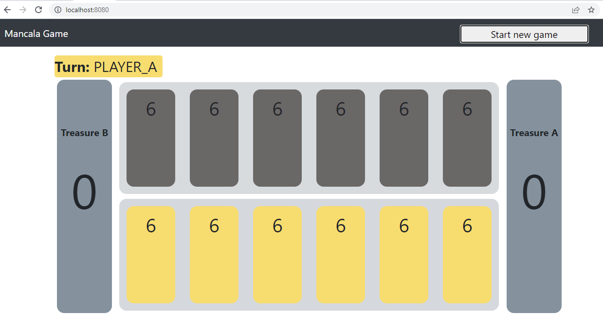

# Mancala Game Application

This project contains traditional mancala game that is played by two player with stones.The application also includes
rest api for game operations which can be used by any other client.

## Technologies

The project includes both frontend and backend.

- `Java 11`
- `Spring Boot` For rest api of the game operations
- `MongoDB`, NoSQL database for persisting the game information
- `Swagger`, Swagger-UI, for API documentation
- `Thymeleaf` Thymeleaf for user interface
- `HTML`,
- `JQuery`

## Installation

Use the maven to build the project for development.

```
mvn clean install
```

## Usage

The application jar can be run standalone with the following command.

```
java -jar mancalagame-0.0.1-SNAPSHOT.jar
```

### Game application

Game is played by selecting one of the (yellow) pits to move.

```  
http://localhost:8080
```  



### Rest api

There are three rest operations.

* Create a game on start

```  
 GET http://localhost:8080/mancala/create
``` 

* Get the existing game with game id

```  
 GET http://localhost:8080/mancala/get?gameId:{gameId}
```

* Make move with game id and pit id

```  
 GET http://localhost:8080/mancala/move?gameId:{gameid}&pitId={pidId}
```


### Swagger documentation

Swagger api documentation for detail of the operations.

```  
http://localhost:8080/swagger-ui/index.html#
```  

## Test

Unit tests can be run by the following maven command.

```
mvn test
```

To check test coverage report, the jacoco report can be generated with the following command.

```
mvn jacoco:report
```

